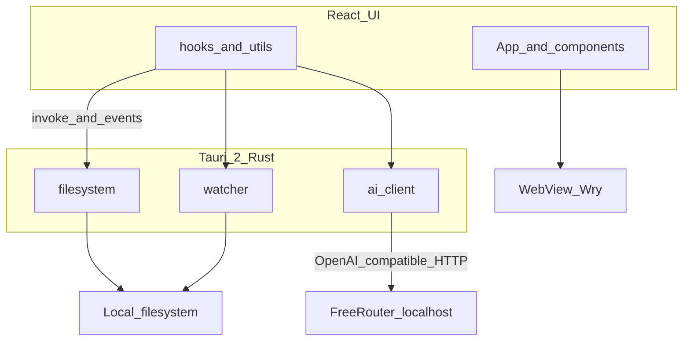

# StudyShell

[](https://github.com/tom-schneidr/studyshell/actions/workflows/ci.yml)

**A desktop study workspace** — local files, PDF annotation, multimodal viewers, and AI study tools in one native app.

StudyShell is a Tauri-powered desktop app that treats your coursework folder like a personal study OS: browse and edit notes and code, annotate PDFs, preview notebooks and media, and chat with an AI assistant grounded in your open files. AI requests are proxied through Rust to a local [FreeRouter](https://github.com/tom-schneidr/FreeRouter) gateway so provider API keys never live in the WebView.

## Why it exists

Managing university materials across folders, PDFs, and ad-hoc AI tabs is fragmented. StudyShell unifies file browsing, editing, and AI assistance in a single desktop shell with native filesystem access, live directory watching, and persistent workspace state. Building it was a way to learn full-stack desktop development: React UI in a WebView, Rust for privileged I/O and HTTP streaming, and a clean separation between the frontend and external AI routing.

> **Portfolio note:** AI features require [FreeRouter](https://github.com/tom-schneidr/FreeRouter) running locally. A demo video can be linked here when available.

**Roadmap:** see [docs/ROADMAP.md](docs/ROADMAP.md)

## Architecture



| Layer | Role |
|-------|------|
| `src/` | React 19 UI — editors, viewers, chat, layout |
| `src-tauri/` | Rust backend — file I/O, FS watch, AI HTTP proxy |
| FreeRouter | Local AI gateway — provider keys and routing |

## Tech stack

| Area | Technologies |
|------|----------------|
| UI | React 19, TypeScript, Vite 7, Tailwind CSS 4 |
| Desktop | Tauri 2, Rust (tokio, reqwest, notify) |
| Editing | CodeMirror 6, TipTap, react-pdf, pdf-lib |
| AI | FreeRouter (OpenAI-compatible API via Rust) |

## Features

- Local workspace browser with live filesystem refresh
- Markdown, plain text, and code editing with syntax-aware support
- Notebook, image, audio, video, and PDF previewing
- PDF annotation, save, and export workflows
- AI chat assistant contextualized by active files and selected sources
- Flashcard and quiz generation from study materials
- Workspace search, command palette, and recent file history
- Persistent layout, theme, and study timer state

## Prerequisites

- Node.js 22+ and npm
- Rust toolchain
- [FreeRouter](https://github.com/tom-schneidr/FreeRouter) running locally (default `http://127.0.0.1:8000/v1`)

## Run locally

```bash
npm install
npm run tauri:dev
```

This starts the Vite dev server and opens the Tauri desktop window with full filesystem and AI integration.

`npm run dev` runs Vite alone in the browser — useful for UI work, but most features require the Tauri shell.

### Build for production

```bash
npm run tauri:build
```

## Configuration

Copy `.env.example` to `.env` at the project root:

```bash
cp .env.example .env
```

```env
FREEROUTER_BASE_URL=http://127.0.0.1:8000/v1
```

Start FreeRouter before using AI features. Provider API keys are configured in FreeRouter, not in StudyShell.

### Security

- Never commit `.env` — it is gitignored; use `.env.example` as the template.
- API keys belong in FreeRouter only.

StudyShell migrated from a direct Vertex integration to FreeRouter in the 0.2.x line.

## Project structure

- `src/` — React frontend and UI components
- `src-tauri/` — Tauri backend, Rust commands, native integrations
- `public/` — static assets
- `tests/` — Node unit tests for shared utilities
- `docs/` — internal roadmap and documentation

## Testing

```bash
npm run verify
```

Or run individually:

```bash
npm run typecheck
npm run test
cargo test --manifest-path src-tauri/Cargo.toml --lib
```

## License

This project is released under the [MIT License](LICENSE).
